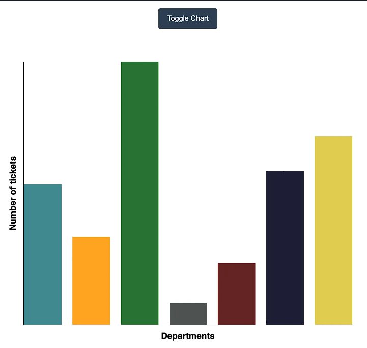
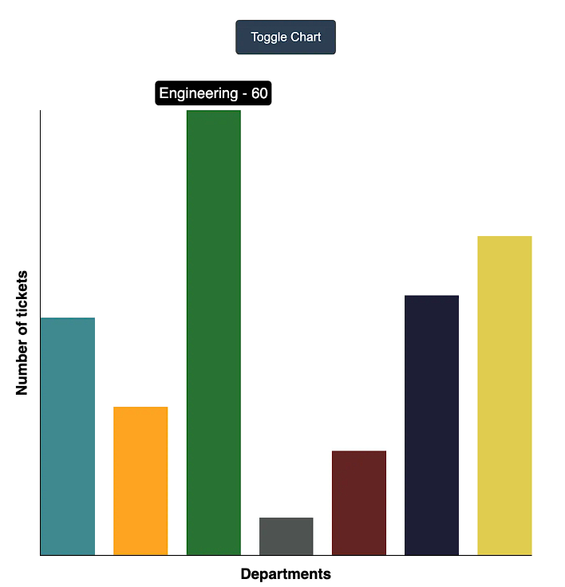

## Question
The question is to  build an interactive bar chart similar to velocity charts.

## Functional Requirements
- There should be a button that can be used to toggle the visibility of the chart.
- Department data would be provided using which we need to draw a Bar chart where Y axis represents the no. of tickets and X axis represents the departments.
- Each bar should have a tooltip that displays department name along with no. of tickets when a bar is hovered.
- Bar's height should animate from 0 to final value upon entry and exit.

## Reference Images

