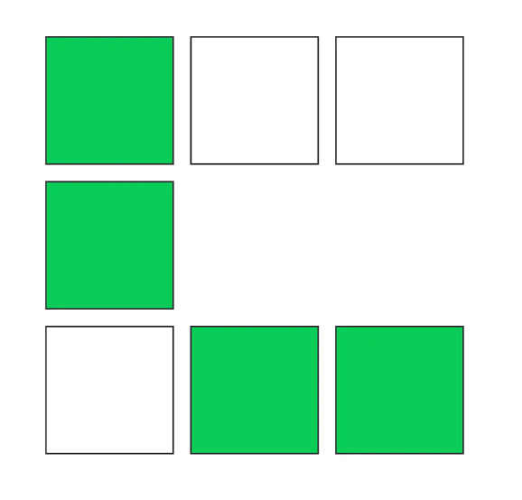

## Question

Create a shape based on a given 2D array. A shape is a collection of empty boxes placed at values that are true in the provided array.

## Functional Requirement
- Create an empty box where array value is 1.
User can select a box. 
- Upon selection the box background color should change to #0bcc59.
- Once all boxes are selected then the boxes should auto-deselect based on the order of selection.
- Deselection should be non-interruptible as in once started, we can't stop it.
- During de-selection, user should not be able to select a new box as in disable any box interaction.

##

- Shape with empty boxes

- Shape with some filled boxes
